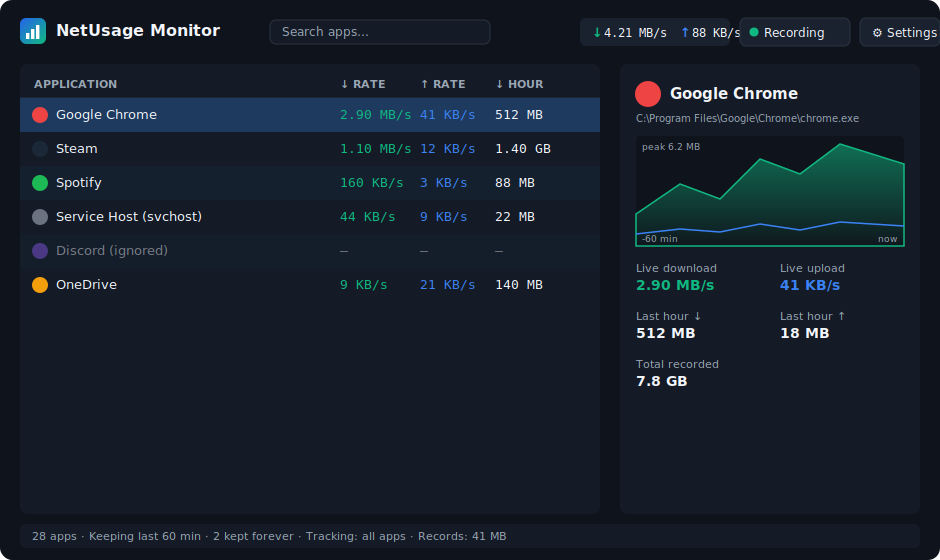

# NetUsage Monitor

**See exactly which apps are using your internet — live and over the last hour — on Windows.**

NetUsage Monitor is a lightweight, high-performance desktop app that shows the **live network
usage of every application** (download/upload speed) plus a **rolling history** of how much each
app has used. It groups multiple instances of the same program together (like Task Manager), shows
each app's **name and icon**, and lets you **keep**, **ignore**, or **focus on** specific apps.

It records **only the amount of data** used (KB / MB / GB) — never the contents of your traffic.

<p align="center">
  
</p>

> Keywords: windows network usage monitor · per-app bandwidth · data usage · per-process network ·
> background data tracker · which app is using my internet · bandwidth monitor · network meter

---

## Features

- 📊 **Live per-app usage** — download and upload speed for every process, updated every second.
- 🕑 **History** — keeps the **last hour** of usage by default and prunes older data automatically.
- ♾️ **Keep forever** — mark specific apps to **record indefinitely** (their history is never deleted).
- 🧩 **Grouping** — all instances of one program (e.g. every `chrome.exe`) are combined into one row.
- 🖼️ **Names + icons** — apps are shown by friendly name and their real icon, like Task Manager.
- 🔍 **Search & sort** — filter by name/path and sort by any column (top talkers float to the top).
- 🎯 **Focus / ignore** — *Only track this app*, or *Ignore* apps you don't care about.
- 🗂️ **Choose where records live** — pick any folder for the records database.
- 🔌 **Runs in the background** — closing the window minimizes to the tray and keeps recording.
- 🚀 **Start with Windows** — optional auto-start (minimized) at sign-in.
- 🗑️ **Full control of data** — delete one app's records, old records, or everything, anytime.
- 📤 **Export** — export the current view to CSV.
- 🔒 **Private** — stores byte counts only; no packet contents, no URLs, nothing leaves your PC.

---

## Download & run

1. Go to the [**Releases**](../../releases) page and download `NetUsageMonitor.exe`.
2. **Right-click → Run as administrator.** *(Required — see [Why administrator?](#why-administrator))*
3. The window opens with a live list of apps using the internet.
4. *(Optional)* **Pin to taskbar:** right-click the taskbar icon → *Pin to taskbar*.
5. *(Optional)* Open **⚙ Settings** → enable **Start with Windows** and **Keep recording in the background**.

It's a **single self-contained `.exe`** — no installer and no need to install .NET.

---

## How to use it

| I want to… | Do this |
|---|---|
| See what's using the internet right now | Just open it — sort by **↓ Rate** (default). |
| Keep a specific app's history forever | Right-click the app → **Keep records indefinitely**. |
| Stop recording an app entirely | Right-click → **Ignore this app**. |
| Record only one (or a few) apps | Right-click → **Only track this app** (switches to "only selected" mode). |
| Go back to recording everything | Right-click → **Track all apps**. |
| Change how long history is kept | **⚙ Settings → Retention**. |
| Choose where records are stored | **⚙ Settings → Records location → Browse**. |
| Delete records | Right-click an app → *Delete this app's records*, or **⚙ Settings → Manage records**. |
| Keep recording after closing the window | It minimizes to the tray automatically (toggle in Settings). To fully quit, use the **tray icon → Exit**. |
| Pause/resume all recording | Top bar **Recording** button, or tray menu. |

---

## How it works

- **Measurement:** uses Windows **ETW** (Event Tracing for Windows) kernel TCP/UDP providers — the
  same data source Task Manager and Resource Monitor use — to count bytes sent/received **per
  process**. This is accurate and low-overhead (no packet capture, no network driver, no proxy).
- **Live vs. history:** byte counts are aggregated each second for the live view and written to a
  local **SQLite** database every few seconds for history.
- **Retention:** a background task deletes samples older than your retention window (default 60
  minutes) — **except** for apps you marked *Keep records indefinitely*.
- **Grouping:** apps are grouped by their executable path, so multiple processes of the same program
  share one row and one total.
- **Performance:** the hot path only does interlocked counter increments; resolving names/icons is
  cached; database writes are batched. Typical CPU use is negligible.

---

## Privacy

NetUsage Monitor records **how much** data each app transfers — never **what** it transfers.
There is no packet inspection, no hostnames, no payloads. All data stays in a local database in the
folder you choose. Nothing is uploaded anywhere.

---

## FAQ

### Why administrator?
Reading **per-application** network byte counts on Windows requires an ETW kernel session, which
needs administrator rights. There is no non-admin Windows API that attributes bandwidth to a
specific process. The app requests elevation automatically (UAC prompt) on launch. To avoid the
prompt at sign-in, enabling **Start with Windows** installs a scheduled task that launches it
elevated without prompting.

### Where are my records stored?
By default in `%LOCALAPPDATA%\NetUsageMonitor\netusage.db`. Change it in **⚙ Settings**.
Settings live in `%APPDATA%\NetUsageMonitor\settings.json`.

### Does it slow down my PC or internet?
No. It only listens to lightweight kernel counters and batches small database writes. It does not
sit in your network path, so it cannot slow your connection.

### Will it record while I'm not looking?
Yes, if **Keep recording in the background** is on (default) — closing the window minimizes it to
the tray and recording continues. Use the tray icon's **Exit** to stop completely.

---

## Build from source

Requirements: [.NET 8 SDK](https://dotnet.microsoft.com/download) on Windows x64.

```powershell
git clone https://github.com/<your-username>/NetUsageMonitor.git
cd NetUsageMonitor
powershell -ExecutionPolicy Bypass -File build.ps1
# -> dist\NetUsageMonitor.exe
```

Or directly:

```powershell
dotnet publish src/NetUsageMonitor/NetUsageMonitor.csproj -c Release
```

### Project layout

```
src/NetUsageMonitor/
  Engine/        ETW capture, process identity, the per-second tracker
  Storage/       SQLite database (samples, retention, history)
  ViewModels/    MVVM view models and commands
  Ui/            converters, icon provider, the history chart, auto-start
  Configuration/ settings model + JSON persistence
  *.xaml         App, MainWindow, SettingsWindow
tools/           icon generator + headless test probes
.github/workflows/release.yml   tag a vX.Y.Z to build + publish a release
```

---

## Tech

C# · .NET 8 · WPF · ETW (`Microsoft.Diagnostics.Tracing.TraceEvent`) · SQLite (`Microsoft.Data.Sqlite`).

## License

[MIT](LICENSE).
